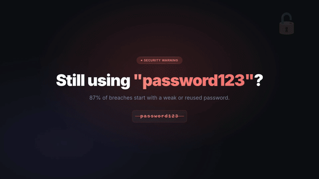
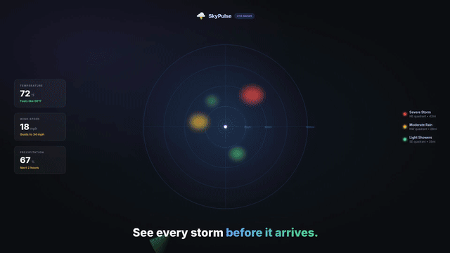
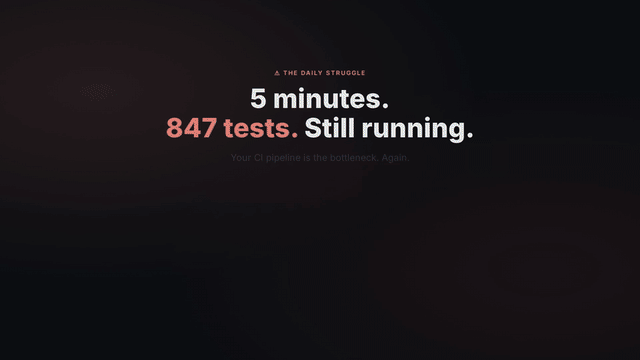
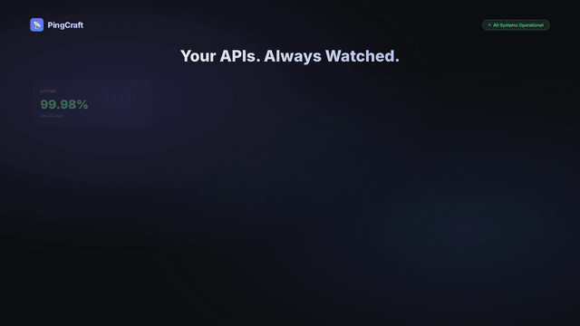

# framecraft

[](https://github.com/alirezarezvani/claude-skills)

An LLM skill & plugin for creating polished demo videos. You describe what you want — your LLM writes the HTML scenes, narration, and config, then framecraft renders everything.

**Not a framework.** A pipeline that gives your LLM the tools to produce real video.

[](https://github.com/vaddisrinivas/framecraft/releases/download/v0.5-demo/framecraft-demo.mp4)

> *This demo was made with framecraft itself — one prompt, zero screen recording. [Watch with audio](https://github.com/vaddisrinivas/framecraft/releases/download/v0.5-demo/framecraft-demo.mp4).*

## Prerequisites

| Requirement | Install |
|-------------|---------|
| Python 3.11+ | [python.org](https://www.python.org/downloads/) |
| `uv` | `brew install uv` or `pip install uv` |
| Node.js + npx | [nodejs.org](https://nodejs.org/) |
| `ffmpeg` binary | `brew install ffmpeg` |
| Internet access | Required for Edge TTS (no API key needed) |

## Install

```bash
claude plugin marketplace add vaddisrinivas/framecraft
claude plugin install framecraft
```

Then install Playwright's Chromium browser (one-time):

```bash
uv run playwright install chromium
```

That's it. The plugin auto-configures everything — the skill that teaches your LLM how to make demos, plus all 4 MCP servers (Playwright, FFmpeg, Edge TTS, and the framecraft pipeline).

## Usage

```
You: "Make a demo video for my tab organizer extension"
```

Your LLM handles the rest — writes custom HTML scenes, generates voiceover, captures frames, composites the video. You get a polished 1920x1080 MP4 with transitions and narration.

## What the plugin provides

| Component | What it does |
|-----------|-------------|
| **Skill** (`skills/demo-video/SKILL.md`) | Teaches your LLM story structure, visual design, narration craft, pacing |
| **Pipeline** (`framecraft.py serve`) | Validation, rendering, export, project scaffolding — as MCP tools |
| **MCP config** (`.mcp.json`) | Auto-configures all 4 MCP servers on install |
| **Format** (`scenes.json`) | Scene schema with screenshots, callouts, zoom, custom HTML, voice per scene |
| **Templates** | Reusable HTML scenes — title cards, browser mockups, end cards |

## MCP servers (auto-configured)

| Server | Purpose | Powered by |
|--------|---------|-----------|
| `framecraft` | Pipeline: render, validate, export, scaffold | bundled |
| `playwright` | Captures HTML scenes as frames | [@playwright/mcp](https://github.com/microsoft/playwright-mcp) |
| `ffmpeg` | Video compositing, transitions, audio mixing | [ffmpeg-mcp-lite](https://github.com/kevinwatt/ffmpeg-mcp-lite) |
| `edge-tts` | Neural voiceover — 10 voices, free, no API key | [edge-tts-mcp](https://github.com/yuiseki/edge_tts_mcp_server) |

All 4 auto-start when the plugin is installed. Override any in your Claude settings.

## Voices

10 neural voices via Edge TTS — free, no API key:

| Name | Accent | Personality |
|------|--------|------------|
| `andrew` | US | Warm, conversational — product demos (default) |
| `jenny` | US | Clear, upbeat — tutorials |
| `davis` | US | Deep, authoritative — serious tone |
| `brian` | US | Professional, measured |
| `emma` | US | Friendly, enthusiastic |
| `aria` | US | Expressive, natural |
| `guy` | US | Casual, relaxed |
| `amber` | US | Warm, approachable |
| `ryan` | British | Polished — premium positioning |
| `sonia` | British | Professional, clear |

## Templates

Reusable HTML scenes from the [gTabs](https://github.com/vaddisrinivas/gtabs) demo:

| Template | What it shows |
|----------|--------------|
| `title-card.html` | Product name + tagline + version badge |
| `browser-mockup.html` | Chrome window with 24 messy tabs |
| `browser-groups.html` | Chrome window with color-coded tab groups |
| `end-card.html` | Logo + GitHub URL + CTA badges |

Your LLM can use these as starting points or write entirely custom HTML scenes.

## Self-demo

The `scenes/framecraft-demo/` directory contains the scenes used to create framecraft's own demo video — portal animations, chat mockups, pipeline diagrams, and a meta self-reference. A working example of what the plugin produces.

## Example demos (auto-generated)

Every push to master generates a demo video from a single prompt — no screen recording, no editing. Each run is verifiable via the linked CI logs.

| Product | Preview | Duration | Mode | CI Run | Full video |
|---------|---------|----------|------|--------|------------|
| VaultKey |  | 14s | plugin | [run](https://github.com/vaddisrinivas/framecraft/actions/runs/23930802124) | [Watch](https://github.com/vaddisrinivas/framecraft/releases/download/examples/password-manager.mp4) |
| SkyPulse |  | 14s | plugin | [run](https://github.com/vaddisrinivas/framecraft/actions/runs/23931058867) | [Watch](https://github.com/vaddisrinivas/framecraft/releases/download/examples/weather-app.mp4) |
| turbotest |  | 16s | MCP-only | [run](https://github.com/vaddisrinivas/framecraft/actions/runs/23931398647) | [Watch](https://github.com/vaddisrinivas/framecraft/releases/download/examples/cli-tool.mp4) |
| PingCraft |  | 11s | plugin | [run](https://github.com/vaddisrinivas/framecraft/actions/runs/23930509050) | [Watch](https://github.com/vaddisrinivas/framecraft/releases/download/examples/api-monitor.mp4) |

*Latest: turbotest | Mode: MCP-only | Cost: $1.06 | 49 turns | 14 min | 1.8M tokens*
*Generated by [test-plugin.yml](.github/workflows/test-plugin.yml) — click any "run" link to verify.*

## Featured In

### ✅ Merged

| Project | What | PR |
|---------|------|----|
| [alirezarezvani/claude-skills](https://github.com/alirezarezvani/claude-skills) | framecraft skill | [#475](https://github.com/alirezarezvani/claude-skills/pull/475) |
| [alirezarezvani/claude-skills](https://github.com/alirezarezvani/claude-skills) | code-tour skill | [#476](https://github.com/alirezarezvani/claude-skills/pull/476) |
| [affaan-m/everything-claude-code](https://github.com/affaan-m/everything-claude-code) | code-tour (native port) | [da813d4](https://github.com/affaan-m/everything-claude-code/commit/da813d4) |
| [xyNNN/awesome-chrome](https://github.com/xyNNN/awesome-chrome) | gTabs | [#31](https://github.com/xyNNN/awesome-chrome/pull/31) |

## Origin

Built while creating the demo video for [gTabs v0.4](https://github.com/vaddisrinivas/gtabs). The `examples/` and `templates/` come from that project.

## License

MIT

---

**Author:** Srinivas Vaddisrinivas ([GitHub](https://github.com/vaddisrinivas))
**Contact:** vaddisrinivas170497@gmail.com
**Contributors:** [CONTRIBUTORS.md](CONTRIBUTORS.md) — Integration status, maintainers, distribution
